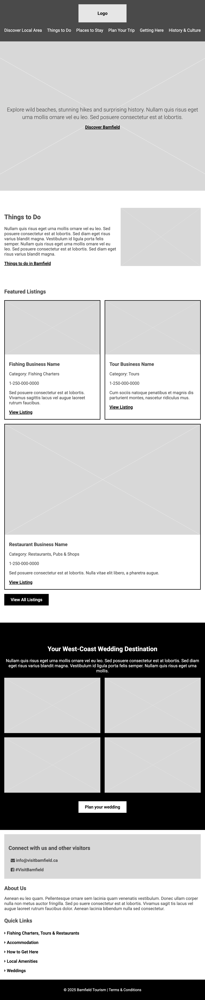
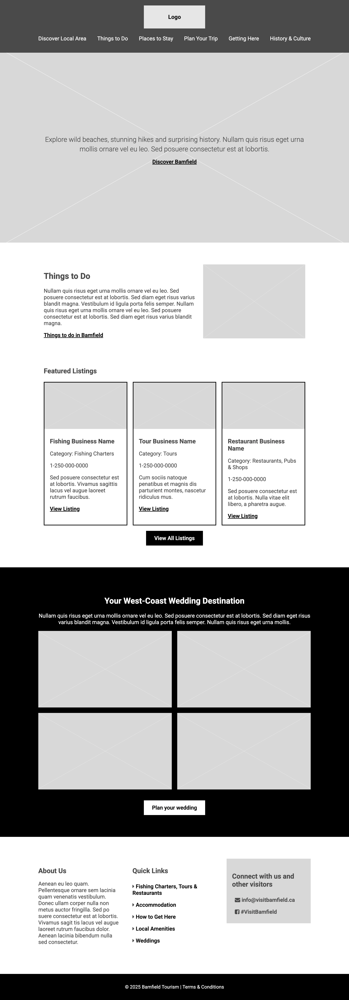

# Exercise 5: Responsive Layouts

## Objectives

You have been provided with all the HTML and CSS for the mobile layout of a webpage. Add the HTML and CSS needed to create the ipad and laptops layouts for the webpage. 

## Instructions

Tips:

  - Remember to make regular commits and pushes. You will lose 30% of your grade if your commits don't document your progress.
  - Only use the code we have learnt in class so far.
  - *Don't use AI!* Instead ask for help using the Slack channel.

### 1. Adapt the code for iPad Mini
1. Clone your remote exercise repository onto your local machine.
2. In VS Code, carefully read the code that was provided in index.html and style.css. In the browser, use the developer tools to inspect and understand how the styles affect the HTML.
3. View the web page at iPad size:
    - In the browser, right-click > Inspect. 
    - In the DevTools window, click on the Toggle Device button (in top left-hand corner).
    - In the browser window, select iPad Mini from the Dimensions drop down menu.
4. In VS Code, add the following ipad media query at the bottom of your CSS:
 ```
/* Medium devices (vertical ipads, 768px and up) */
@media only screen and (min-width: 768px) {
} 
```
5. Add to and edit the HTML/CSS so that the page's layout on iPad looks like the image below.
   - Your HTML should be clean and semantics. You can edit the existing HTML.
   - The CSS should be well organised and make the most of the styles that already exist. You can edit the existing CSS.
   - The hamburger menu icon shoud be absent on ipad, all the menu items should be visible, you can use the Responsive Nav codepen as inspiration: https://codepen.io/AskClaireGuiot/pen/BaMydwd?editors=1100
   - Make sure that your ipad HTML and CSS are perfectly finished and your CSS is well organized before you move on to the laptop layout or your code will become a mess. 


### 3. Adapt the layout for laptops

1. In the browser window, select Responsive from the Dimensions dropdown. Type 1024px in the Dimensions: Responsive settings.
2. In VS Code, add the following media query at the bottom of your CSS:
 ```
/* Large devices (large laptops 1024px and up) */
@media only screen and (min-width: 1024px) {
} 
```
3. Add to and edit the HTML/CSS so that the page's layout on laptops looks like the image below.
    - You'll need to make the content no wider than 800px with automatically adjusting margins of negative space on the left and right.
    - If your computer has a small screen and you can't see the whole website width then can use the zoom setting to scale down the website.


### Bonus - not graded:
Note: For a professional website I would also check what the layout looks like in between the breakpoints. _You do not need to do this for the exercise_:

1. In the browser window, select Responsive from the Dimensions drop down menu.
2. Drag to expand your viewport width and watch how your layout behaves at all sizes.
3. If anything in the layout looks awkward, record the viewport width and add a new media query using the width of the viewport as the min-width.

### 5. Format, organize and add comments

- Use the Prettier VSCode extension to format HTMl and CSS code.
- Add organizational CSS comments and order your style rules so that your CSS is easy to read.
- Add a few comments to explain your HTML and CSS code and highlight anything of interest.

### 6. Check for errors

- Use the VSCode HTMLHint extension and validate your HTML code to make sure that it is correct: https://validator.w3.org/#validate_by_upload. Take a screenshot of the results.
- Validate your CSS code to make sure that it is correct: https://jigsaw.w3.org/css-validator/ for CSS. Take a screenshot of the results.

**You have now completed your exercise but you still need to push your edits to GitHub and submit it in Brightspace. Make sure to follow the instructions in the How to Complete Your Exercises Guide.**
